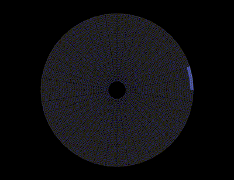

# CoMMA (COarse Mesh Multigrid Agglomerator)

<div align="center">
    
</div>

**CoMMA** is a suite of graph algorithms meant to operate on the graph
representation of an **unstructured** computational mesh.

## :triangular_ruler: Capabilities
- Sequential by zone (i.e. no coupling with graph partitioner);
- Fine faces conservation for coarse levels;
- Optimization of the shape of the coarse cells w.r.t their aspect ratio;
- Connectivity of coarse cells;
- Detection and treatment of anisotropic regions;
- Isotropic agglomeration with structured-like treatment of structured-like
  regions.

## :wrench: Building the Library
CoMMA is a `C++` **header-only library** hence it does not need compilation, per
se. Nonetheless, a `python` module can be generated using `pybind11`: this is
very convenient for testing and debugging purposes. Moreover, some tests via
`Catch2` have been written to check the integrity of CoMMA. Both the `python`
module and the tests need compilation.

To build this library you need:
- A fairly recent `cmake` (3.14+)

You should be able to install them with your distribution package manager or
you can checkout [spack](https://spack.readthedocs.io/en/latest/).

In order to build them, just create a directory named `build` and do an
out-of-source build with `cmake`

```shell
mkdir build
cd build
cmake ..
```

An option is available to use the flags usually considered when compiling the
CODA-CFD library:
```shell
cmake -DCODAFLAGS=ON ..
```

`cmake` should be able to find the simple dependencies by itself if they're
installed in standard location.

## :construction_worker: Usage
The interface to CoMMA is very simple and consists in only one function
[`agglomerate_one_level`](https://numerics.gitlab-pages.onera.net/solver/comma/_co_m_m_a_8h.html#abfb7a4b061c35873233941bb1329ea09).

## :book: Documentation
CoMMA is documented via `doxygen`. If you have it and wish to have the full
documentation, just run from the main directory:
```shell
doxygen Documentation/Doxyfile
```
and related html pages will be built in `documentation`.

An [online version](https://numerics.gitlab-pages.onera.net/solver/comma/) of
the doc hosted by GitLab is available.

## :bulb: Examples
Here are two animations about the agglomeration on a 2D mesh of a ring for two
different option settings:
* Seeds pool with
  [full initialization](https://numerics.gitlab-pages.onera.net/solver/comma/struct_s_p_full_initializator.html)
  and
  [boundary priority](https://numerics.gitlab-pages.onera.net/solver/comma/class_seeds___pool___boundary___priority.html)

<div align="center">
    
</div>

* Seeds pool with
  [one-point initialization](https://numerics.gitlab-pages.onera.net/solver/comma/struct_s_p_one_point_initializator.html)
  and
  [neighbourhood priority](https://numerics.gitlab-pages.onera.net/solver/comma/class_seeds___pool___neighbourhood___priority.html)

<div align="center">
    
</div>

## :link: Submodules
To handle the `python` binding and the tests, we take advantage of two
thirdparty libraries here included as submodules.

In order to update the submodules do:

```shell
git submodule init
git submodule update
```

## :bow: Convenient scripts
The file `CODA_transfer.sh` help for the installation in the CODA-CFD library.

## :mag: Testing CoMMA
A set of tests to verify code and algorithm integrity has been set up, see
[the related file](tests/test_structure.cpp). The tests rely on the `Catch2`
framework, which is why the related submodule is included in this repository. To
run the tests, build the library (see [above](#wrench-building-the-library), the
`cmake` commands related to the tests are already part of the reference
[`CMakeLists.txt`](CMakeLists.txt)),
this will generate an executable `Comma_test` in the building directory, simply
run it.
```shell
mkdir build
cd build
cmake ..
make
./Comma_test
```

Tests are included in the
[continuous integration](#robot-continuous-integration) set of actions.

## :snake: A `python` interface to CoMMA
A `python` module which interfaces to CoMMA can be obtained using `pybind11` (a submodule of
CoMMA). To have it, just "build" (see [above](#wrench-building-the-library),
related the `cmake` commands are already part of the reference
[`CMakeLists.txt`](CMakeLists.txt)): a library called
`CoMMA.cpython-38-x86_64-linux-gnu.so` (or similar) appears in the build
directory. To use it, add the directory to your `python` path:
```shell
export PYTHONPATH:/path/to/CoMMA/build:$PYTHONPATH
```
then just load CoMMA module in a `python` session:
```python
import CoMMA

# Do python stuff
```

Like standard `C++` CoMMA, the `python` module contains only one
function, the counterpart of
[`agglomerate_one_level`](https://numerics.gitlab-pages.onera.net/solver/comma/_co_m_m_a_8h.html#abfb7a4b061c35873233941bb1329ea09).
It has just the very same input arguments, only, all arguments are necessary (no
defaulted parameters). However, differently from the `C++` version, it returns
three lists:
* `fc_to_cc`: list telling the ID of the coarse cell to which a fine cell
  belongs after agglomeration
* `aggloLines_Idx`: connectivity for the agglomeration lines: each element
  points to a particular element in the list `aggloLines`
* `aggloLines`: list storing all the elements of the anisotropic lines.

```python
import CoMMA
fc_to_cc, aggloLines_Idx, aggloLines = CoMMA.agglomerate_one_level(*[args])
```

## :robot: Continuous Integration
A Continuous Integration (CI) [workflow](.gitlab-ci.yml) is available and it
runs at each push event concerning `C++` or CI files (at least with the current
configuration). The workflow performs several steps:
1. Check out the repository and the submodules.
2. Do the build, both the tests and the `python` module (same as
   [above](#wrench-building-the-library)).
3. Run the tests and code coverage (done with
   [`gcovr`](https://gcovr.com/en/stable/) `python` module). This enables us to
   have nice badges related to the status of the pipeline
   [](https://gitlab.onera.net/numerics/solver/comma/-/commits/main)
   and the coverage
   [](https://gitlab.onera.net/numerics/solver/comma/-/commits/main)
4. Build the documentation (same as [above](#book-documentation)) and deploy it
   on a [GitLab page](https://numerics.gitlab-pages.onera.net/solver/comma/)

### :exclamation: Things to be aware of
A presentation of the ONERA-hosted CI is available
[here](https://gitlab.onera.net/numerics/mesh/maia/-/wikis/GitLab-CI-ONERA), we
give below some insights.

The CI on the ONERA-hosted repo runs on **`spiro-commun`**.

Two ways of running are available, directly as shell or through a `slurm` job.
The workflow being simple and not needing many resources, we force the shell
way:
```yaml
default:
  tags: # Use shell instead of submitting pipeline to slurm
    - shell
```

At the time of writing (February 2023), `spiro-commun` is still on **`CentOS
7`**. In order to successfully build and test, an environment (available in
Riccardo's storage and accessible to anyone) is sourced and some checks are
done. A version of the environment for `CentOS 8` is also available in the same
directory as the other.
```yaml
job:init:
    stage: init
    before_script:
        - module purge
        # Load python version, compilers
        - source /stck/rmilani/GitLab_CI_envs/CoMMA_env_el7.sh
        - python3 -c "import gcovr" || python3 -m pip install --user gcovr
```

It is important to notice that **the CI job runs as if launched by the author of
the action** (commit, merge,...) who triggered the job. That means that it will read
its `bash` profile, for instance.

Finally, during the initialization stage, the workflow has to check out the
submodules which are on regular (hence, not ONERA-hosted) GitHub. To do that, it
has to goes through OENRA proxy. Not having set the rights proxy value will
result in a failure of the check out and, hence of the workflow. As you know,
the proxy depends on where at ONERA you are. For this reason, it is left to the
user to have the right setting in its `bash` profile, see the previous paragraph
to know how this is used. Typical settings are:
```shell
export PRX=proxy.onecert.fr:80
# For other users it might be...
#export PRX=proxy.onera.fr:80
export no_proxy=.onera.net,.onera.fr,.onecert.fr
export https_proxy=http://${PRX}
export http_proxy=http://${PRX}
```
